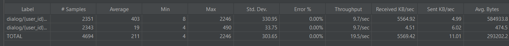

# In-Memory СУБД
### Конфигурация tarantool
Для инициализации спейса с индексами в tarantool необходимо запустить [lua скрипт](tarantool/conf/tarantool_init.lua)

```
docker exec -it tarantool console
# Инициализация спейса, индекса, функции поиска, функция сохранения
dofile('/opt/tarantool/init.lua')
```

#### lua-функции
1) поиск по хешу
```
function search(hash)
return box.space.chat_messages.index.hash:select({hash}, {iterator = EQ})
end
```

2) сохранение
```
function save(id, hash, data)
return box.space.chat_messages:insert({id, hash, data, 6})
end
```

### Нагрузочное тестирование
Запускаем нагрузочный тест [Jmeter](jmeter/otus_highload_test_plan.jmx)

#### До перевода на In-Memory tarantool




#### После перехода на In-Memory tarantool


При одинаковых условиях нагрузки пропускная способность tarantool оказалась намного выше