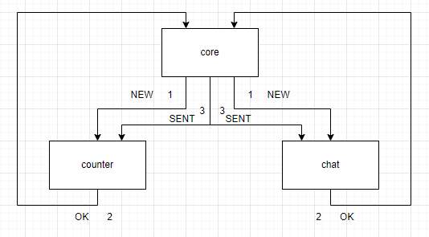
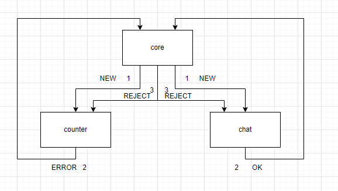
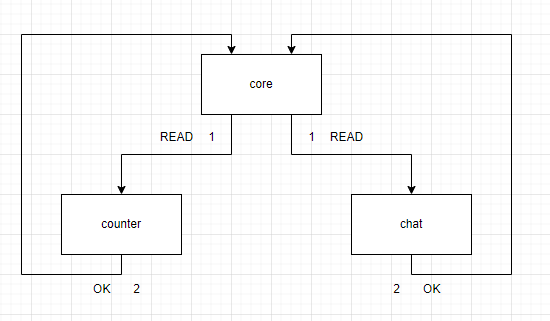
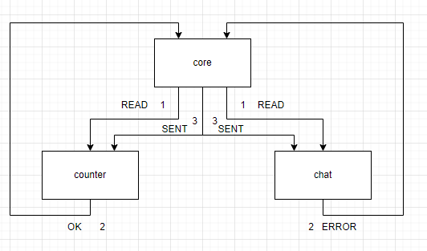

# Распределенные транзакции

В сервисе `chat-service` добавлены новые end-point 
* `PUT` `/api/v1/dialog/update/{id}/{status}` - обновление статуса сообщения

В сервисе `chat-service` добавлены новые end-point
* `POST` `/dialog/read/{message_id}/` - обновление статуса сообщения

В сервисе `counter-service` добавлены новые end-points
* `POST` `/api/v1/counter/{user_id}/add` - создание нового сообщения счетчика
* `PUT` `/api/v1/counter/update/{id}/{status}` - обновление статуса
* `GET` `/api/v1/counter/unread/` - получить кол-во всех непрочитанных сообщений у пользователя
* `GET` `/api/v1/counter/{user_id}/unread/` - получить кол-во всех непрочитанных сообщений у пользователя от другого пользователя

### 1) Для уменьшения нагрузки на чтение сделана реплика БД конфигурирование описано в [configuration-db.md](configuration-db.md)
### 2) SAGA
##### В роли оркестратора выступает `core-service`

##### Workflow создание нового сообщения
###### В позитивном сценарии выполняются 3 действия в асинхронном режиме по HTTP протоколу
*  `core-service` отправляет запросы создания со статусом `NEW` в сервисы `counter-service` и `chat-service`
* `counter-service` и `chat-service` сервисы возвращают `OK`
* `core-service` отправляет запросы на смену статуса `SENT` в сервисы `counter-service` и `chat-service`

###### В негативном сценарии выполняются 3 действия в асинхронном режиме по HTTP протоколу
* `core-service` отправляет запросы создания со статусом `NEW` в сервисы `counter-service` и `chat-service`
* `counter-service` и `chat-service` если одни из сервисов вернет `ERROR` 
* `core-service` отправляет запросы на смену статуса `REJECT` в сервисы `counter-service` и `chat-service`

##### Workflow создание смены статуса на прочитано
###### В позитивном сценарии выполняются 2 действия в асинхронном режиме по HTTP протоколу
*  `core-service`отправляет запросы на смену статуса `READ` в сервисы `counter-service` и `chat-service`
* `counter-service` и `chat-service` сервисы возвращают `OK`

 

###### В негативном сценарии выполняются 3 действия в асинхронном режиме по HTTP протоколу
* `core-service` отправляет запросы на смену статуса `READ` в сервисы `counter-service` и `chat-service`
* `counter-service` и `chat-service` если одни из сервисов не вернет `OK`
* `core-service` отправляет запросы возвращение статуса `SENT` в сервисы `counter-service` и `chat-service`

