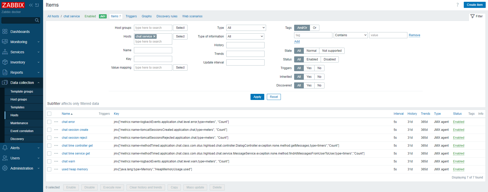
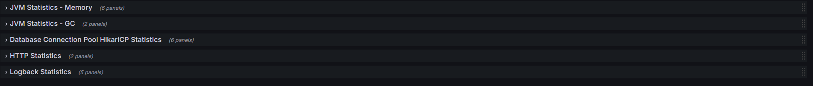

# Мониторинг и алертинг

### Конфигурация zabbix
```
  zabbix-db:
    image: postgres:16-alpine
    container_name: zabbix-db
    environment:
      POSTGRES_USER: zabbix
      POSTGRES_PASSWORD: zabbix_pwd
      POSTGRES_DB: zabbix
    ports:
      - "5555:5432"
    volumes:
      - zabbix-db:/var/lib/postgresql/data

  zabbix-java-gateway:
    image: zabbix/zabbix-java-gateway:alpine-7.0-latest
    container_name: zabbix-java-gateway
    depends_on:
      - zabbix-db

  zabbix-server:
    image: zabbix/zabbix-server-pgsql:alpine-7.0-latest
    container_name: zabbix-server
    environment:
      DB_SERVER_HOST: zabbix-db
      POSTGRES_USER: zabbix
      POSTGRES_PASSWORD: zabbix_pwd
      POSTGRES_DB: zabbix
      ZBX_JAVAGATEWAY: zabbix-java-gateway
      ZBX_JAVAGATEWAY_ENABLE: true
    depends_on:
      - zabbix-java-gateway
      - zabbix-db
    ports:
      - "10051:10051"
      - "10060:10050"
    volumes:
      - zabbix-server:/usr/lib/zabbix/alertscripts

  zabbix-web:
    image: zabbix/zabbix-web-nginx-pgsql:alpine-7.0-latest
    container_name: zabbix-web
    environment:
      DB_SERVER_HOST: zabbix-db
      POSTGRES_USER: zabbix
      POSTGRES_PASSWORD: zabbix_pwd
      POSTGRES_DB: zabbix
      PHP_TZ: Europe/Moscow
      ZBX_SERVER_HOST: zabbix-server
      ZBX_SERVER_PORT: 10051
    depends_on:
      - zabbix-server
    ports:
      - "9999:8080"

  zabbix-agent:
    image: zabbix/zabbix-agent:alpine-7.0-latest
    container_name: zabbix-agent
    environment:
      ZBX_SERVER_HOST: zabbix-server
      ZBX_SERVER_PORT: 10060
      ZBX_HOSTNAME: zabbix-agent
      ZBX_HOSTNAMEITEM: system.hostname
    depends_on:
      - zabbix-db
      - zabbix-server
    ports:
      - "10050:10050"
```
Подключенные zabbix-agent и JMX



### Конфигурация [prometheus](prometheus/prometheus.yml)
```
  cadvisor:
    image: google/cadvisor:v0.33.0
    container_name: cadvisor
    volumes:
      - '/:/rootfs:ro'
      - '/var/run:/var/run:rw'
      - '/sys:/sys:ro'
      - '/var/lib/docker/:/var/lib/docker:ro'
    ports:
      - '9898:8080'

  prometheus:
    image: prom/prometheus:v2.53.0
    container_name: prometheus
    ports:
      - '9090:9090'
    volumes:
      - ./11-monitoring/prometheus/prometheus.yml:/etc/prometheus/prometheus.yml:ro
    command:
      - '--config.file=/etc/prometheus/prometheus.yml'
      - '--storage.tsdb.path=/prometheus'
      - '--storage.tsdb.retention=1d'
    depends_on:
      - cadvisor

  node-exporter:
    image: prom/node-exporter:v1.8.2
    container_name: prom-node-exporter
    user: root
    volumes:
      - /proc:/host/proc:ro
      - /sys:/host/sys:ro
      - /:/rootfs:ro
    command:
      - '--path.procfs=/host/proc'
      - '--path.sysfs=/host/sys'
      - '--collector.filesystem.ignored-mount-points="^/(sys|proc|dev|host|etc)($$|/)"'
    depends_on:
      - prometheus
```
Подключенные endpoints откуда собираються метрики  


### Конфигурация [grafana](grafana/provisioning/datasources/datasource.yml)
```
  grafana:
    image: grafana/grafana:11.1.0
    container_name: grafana
    volumes:
      - grafana:/var/lib/grafana
      - ./11-monitoring/grafana/provisioning:/etc/grafana/provisioning
    environment:
      GF_SECURITY_ADMIN_USER: admin
      GF_SECURITY_ADMIN_PASSWORD: admin
      GF_INSTALL_PLUGINS: grafana-clock-panel 1.0.1,grafana-simple-json-datasource,alexanderzobnin-zabbix-app
    ports:
      - "3000:3000"
```
Дашборды 

### Метрики
#### Бизнес-метрики сервиса чатов по принципу RED


#### Spring Boot метрики приложения
- https://grafana.com/grafana/dashboards/19004-spring-boot-statistics/



#### Технические метрики сервера с сервисом чатов
- https://grafana.com/grafana/dashboards/1860-node-exporter-full/


#### Технические метрики контейнеров Docker
- https://grafana.com/grafana/dashboards/16310-docker-and-system-monitoring/


### Полезные ссылки
https://habr.com/ru/companies/otus/articles/650871/
https://github.com/akmalovaa/zabbix-docker/blob/main/README.md